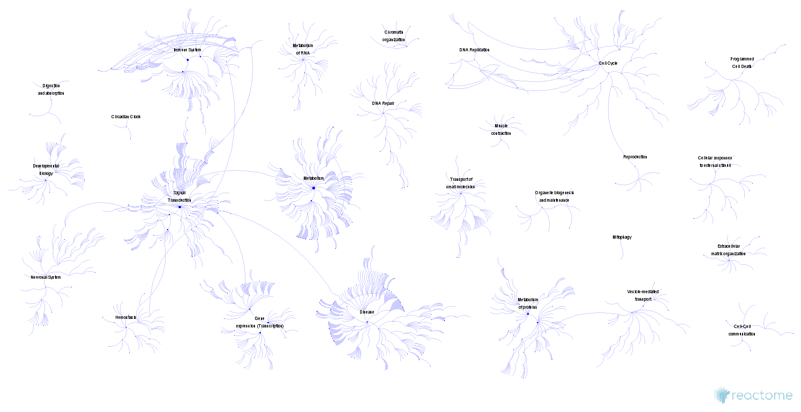
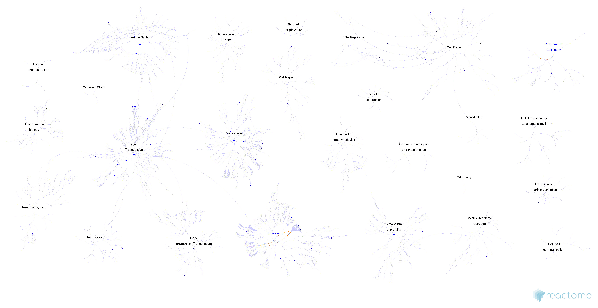
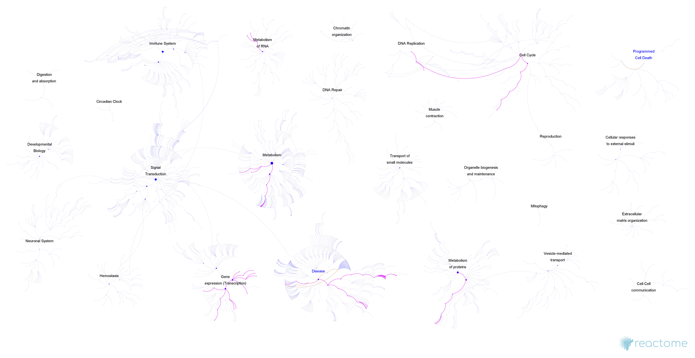
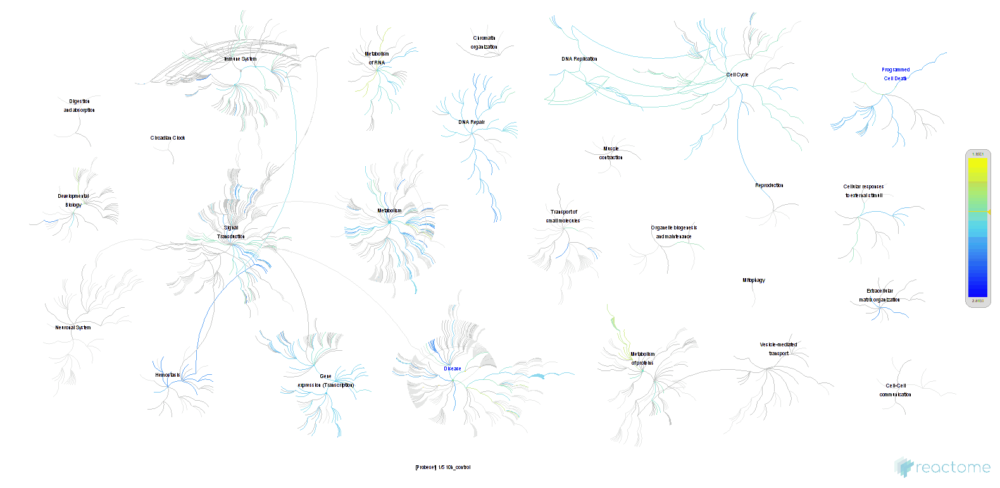

[](https://reactome.org)

Fireworks Exporter
=====================
Service to generate images of top level pathway view (the fireworks).

### Introduction
The [fireworks](https://github.com/reactome-pwp/fireworks) project aims to provide 'a genome-wide, hierarchical visualisation of Reactome pathways in a space-filling graph'.

The fireworks exporter allows to generate this views in png, jpg or gif and download them into your computer.

### Install
Fireworks exporter is a java library. It will be soon available in our maven repository. Until then, you need to download and package the code.

### Usage
#### Resources
fireworks exporter needs access to the json files describing the layout of each species. This files can be found at https://reactome.org/download/current/fireworks/.

#### Exporting a fireworks

A basic fireworks can be created with a few lines of codes.

```java
String fireworks_path = "path/to/fireworks";
FireworkArgs args = new FireworkArgs("Homo_sapiens", "png");
FireworksExporter exporter = new FireworksExporter(args, fireworks_path);
BufferedImage image = exporter.render();
```


To save the image to a file, use the java **ImageIO.write()** method.
```java
File file = new File("images", "Homo_sapiens.png");
ImageIO.write(image, "png", file);
```  
If you want to see some pathways selected into the fireworks, you can specify its stable identifier (stId) or database identifier (dbId).
We can also increase the resolution of the image.

```java
String fireworks_path = "path/to/fireworks";
FireworkArgs args = new FireworkArgs("Homo_sapiens", "png");

args.setSelected(Arrays.asList("R-HSA-169911", "R-HSA-3560792"));
args.setFactor(5.0);

FireworksExporter exporter = new FireworksExporter(args, fireworks_path);
BufferedImage image = exporter.render();
```



Now the pathways (and all of their top level pathways) are highlighted in a different color.

You can also locate a particular molecule using the flag system. The flags allow you to show in a different color the pathways where a molecule (or a set of molecules) is present.

```java
String fireworks_path = "path/to/fireworks";
FireworkArgs args = new FireworkArgs("Homo_sapiens", "png");
args.setFactor(5.0);

// We need a link to the reactome home page to retrieve the pathways.
ContentServiceClient.setHost("https://reactome.org/");
args.setFlags(Arrays.asList("CTP");

FireworksExporter exporter = new FireworksExporter(args, fireworks_path);
BufferedImage image = exporter.render();
```



What if I want a more complex analysis of data? Reactome provides an analysis service that allows to send your data and visualize it on top of the diagram. To see more about how to perform an analysis go to https://reactomerelease.oicr.on.ca/dev/analysis.

Once you have performed the analysis, you only need to specify the token and the reactome server.

```java
// We need a link to the reactome home page to retrieve the pathways.
String fireworks_path = "path/to/fireworks";
FireworkArgs args = new FireworkArgs("Homo_sapiens", "png");
args.setFactor(5.0);

// Analysis tokens get invalidated after a while
// Be sure to perform the analysis before copying the token.
AnalysisClient.setServer("https://reactome.org");
args.setToken("MjAxNzExMzAwOTI3MTBfMTM%253D");

FireworksExporter exporter = new FireworksExporter(args, fireworks_path);
BufferedImage image = exporter.render();
```


You can change the color style if you find it more comfortable. We provide 4 different color profiles:
*Copper*, *Copper plus*, *Barium Lithium* and *Calcium Salts*.

```java
String fireworks_path = "path/to/fireworks";
FireworkArgs args = new FireworkArgs("Homo_sapiens", "png");
args.setFactor(5.0);
AnalysisClient.setServer("https://reactome.org");
args.setToken("MjAxNzExMzAwOTI3MTBfMTM%253D");

args.setProfile("Barium Lithium");

FireworksExporter exporter = new FireworksExporter(args, fireworks_path);
BufferedImage image = exporter.render();
```


Sometimes, an analysis contains time series. To visualise them, images can be exported as animated GIF. This option is only supported with *gif* format.

```java
FireworkArgs args = new FireworkArgs("Homo_sapiens", "gif");
args.setSelected(Arrays.asList("R-HSA-169911", "R-HSA-3560792"));
args.setProfile("Copper plus");
AnalysisClient.setServer("https://reactome.org");
args.setToken("MjAxNzExMzAwOTI3MTBfMTM%253D");
FireworksExporter exporter = new FireworksExporter(args, fireworks_path);

File file = new File("images", "Homo_sapiens.gif");
FileOutputStream outputStream = new FileOutputStream(file);
exporter.renderToGif(outputStream);

```


